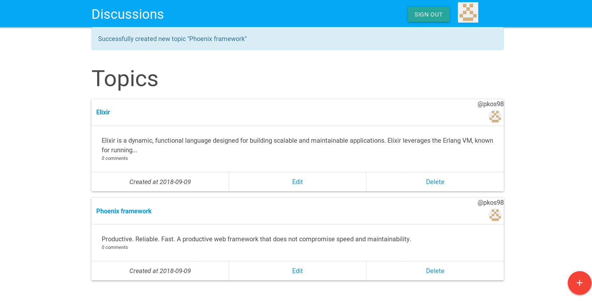

# Discuss

A demo application which provides a "forum-like" functionality.  
You can create topics, edit them, comment them etc...  
It's developed using the Phoenix framework (and thus, elixir).

**Features**:
* CRUD-operations:
  * Create/Edit/Delete topics
  * Create/Edit/Delete comments
* Authorization using *GitHub OAuth*
* *WebSocket/Phoenix-Channels* Live loading of comments:
  * When you are viewing a specific topic, you are directly loading newly posted comments.  
  No need to refresh the page. WebSockets are handling everything for you!

----------------------

To start your Phoenix app:

  * Install dependencies with `mix deps.get`
  * Create and migrate your database with `mix ecto.create && mix ecto.migrate`
  * Install Node.js dependencies with `npm install`
  * Start Phoenix endpoint with `mix phoenix.server`

Now you can visit [`localhost:4000`](http://localhost:4000) from your browser.

Ready to run in production? Please [check our deployment guides](http://www.phoenixframework.org/docs/deployment).

## Learn more

  * Official website: http://www.phoenixframework.org/
  * Guides: http://phoenixframework.org/docs/overview
  * Docs: https://hexdocs.pm/phoenix
  * Mailing list: http://groups.google.com/group/phoenix-talk
  * Source: https://github.com/phoenixframework/phoenix
